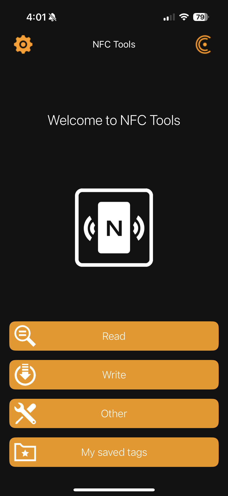
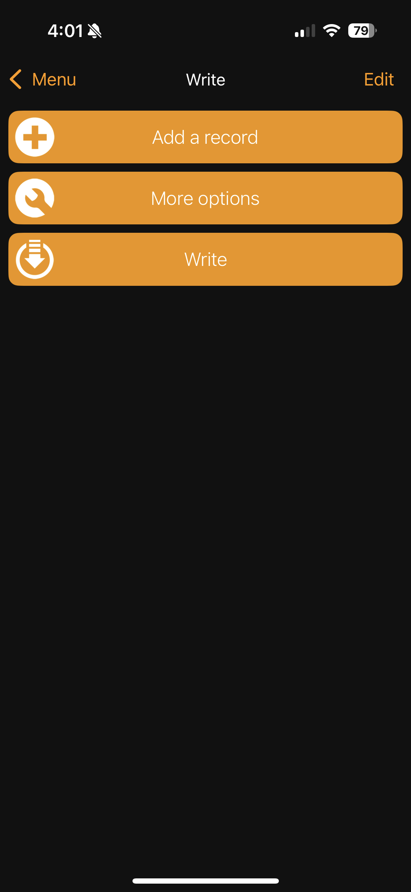
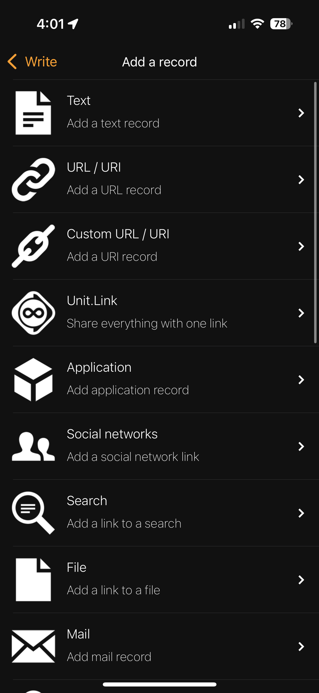
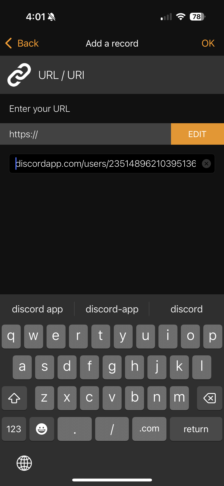
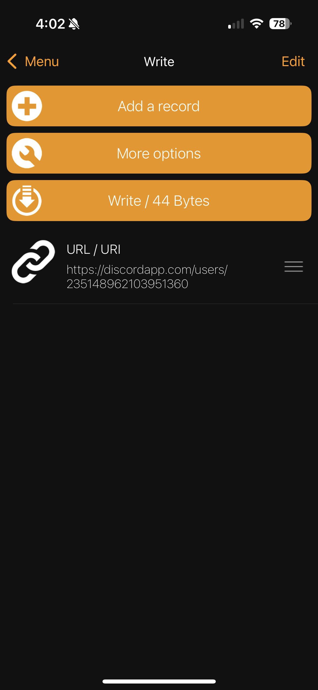
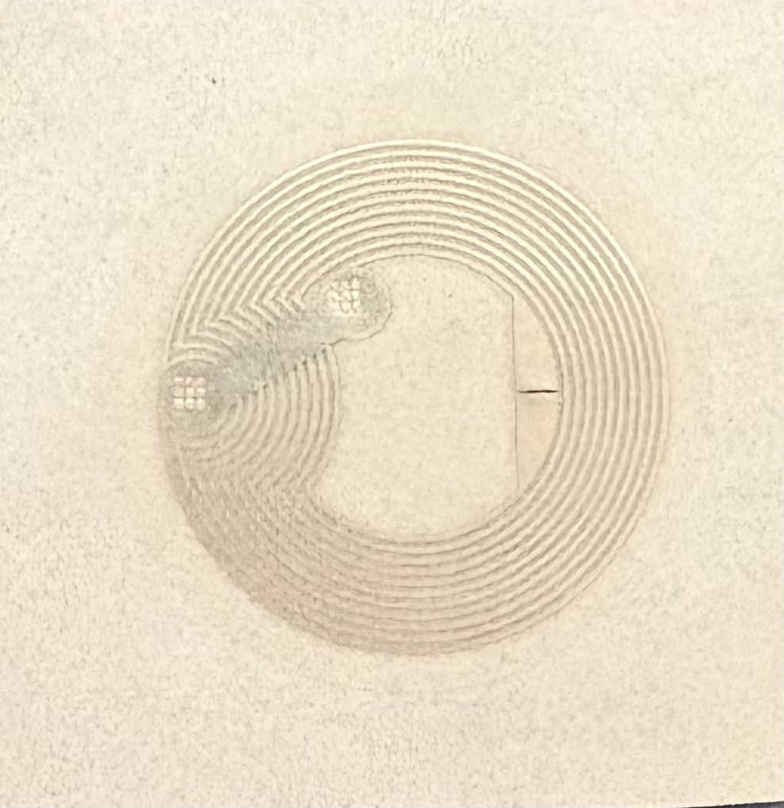

You're likely here because you received an NFC tag from me to put on your convention badge and want to customize it. If this is not the case, you either need to come find me to get one (I don't bite!) or purchase an NFC tag yourself (see [Purchasing](#purchasing)).

## URL/Data Selection
To customize your NFC tag, you need some information to put on it. This can be a URL of some sort, a contact card, phone number, email address, or even something like a WiFi name and password. Good choices include:

#### Discord User Link

You can set up a link to your discord user by copying your discord user id, which can be found by going to your discord settings, Advanced, then turning on Developer Mode. If you then click/tap your discord username, then possibly a (...) button you will see an option called "Copy User ID". If you click/tap that, it should copy a number like `235148962103951360` to your clipboard.

Paste that id number into the following url:

`discordapp.com/users/<YOUR ID HERE>`

Like so:

`discordapp.com/users/235148962103951360`

#### Twitter/Bluesky/Other social media 

Just copy the URL of your profile

#### Carrd

While it is possible to load multiple URLs or other pieces of data onto an NFC tag, when a phone reads the tag it only opens the first URL loaded onto the tag. This means if you have multiple things (social media links, link to your store, etc.) that you want people to see, you will need to aggregate them onto a single URL using something like [Carrd.co](https://carrd.co/).

Alternatively if you're an idiot like me, you could use github pages to do the same thing instead!

## Loading the data onto your NFC Tag

### iOS

The recommended app to write data to your NFC card is [NFC Tools](https://apps.apple.com/us/app/nfc-tools/id1252962749). It's free, with an in app purchase for some more advanced features that are not needed here.

Copy the URL or other info you want to write to the card from the previous section to your clipboard then open the app.

When you open the app, you will be presented with a screen like this:

{: width="400"}

Tap "Write", which will show this screen:

{: width="400"}

Tap "Add a record", which will show this screen:

{: width="400"}

In most cases you'll want to tap "URL/URI". However, there are separate record types for things like email addresses or telephone numbers if you choose to use them. There is also a separate option for Social Networks if you want to use it, however a URL will do the same thing.

When you select a record type it should take you to a screen like this:

{: width="400"}

You should then be able to paste in your URL (or other info if you chose a different record type) into the box. As the bar below "Enter your URL" suggests, you'll want to remove the leading "https://" from your URL if it is there.

Tap "OK" to finish entering the record, which should take you to the following screen:

{: width="400"}

Finally, hold your NFC tag up to the top of your phone and tap "Write". 
Once your tag has been written, you should be able to hold it up to the top of your phone and see a popup prompting you to go to the URL or other info stored in the tag!

### Android

I unfortunately do not have an android device to test with, however it appears that [NFC TagWriter by NXP](https://play.google.com/store/apps/details?id=com.nxp.nfc.tagwriter&hl=en_US&pli=1) works very similarly to the NFC Tools app I used on iOS. The instructions here should show how to write a URL to the tag just like the iOS instructions above:

[Bluebite NFC Tutorial](https://www.bluebite.com/nfc/how-to-write-nfc-on-android)

### Finishing Up

You should now have an NFC Tag that takes you to a URL of your choosing. Make sure to test it by tapping the top of your phone to the tag and make sure that the URL or other data you have programmed into the tag does what you expect (takes you to your twitter, discord, email address, etc.).

## Purchasing

If you did not get an NFC tag from me, or did and want to buy more for future cons and events, there are a couple of options. The tags I was handing out are in the "NTAG" family, specifically "NTAG 213" device. There are a couple of other tags in this family (NTAG 215 and NTAG 216) which have slightly more memory to hold URLs and such. Personally I don't think that the extra memory in these tags is terribly necessary or useful, but you may be able to find one of these tags if NTAG 213 is out of stock.

Additionally, there are several different form factors for the NFC tag. The tags I hand out look like this:

{: width="200"}

And are a small round sticker with the NFC tag and antenna embedded in it. For whatever reason, this is called a "wet inlay" tag. These tags are also available in card form (a plastic card about the size of a credit card) or a keychain form (a round keychain about 25mm in diameter and 4mm thick) as well as a couple other options. Ebay seems to be a good way to get them, and I would recommend the following searches if you're looking to buy some:

- Sticker/"Wet Inlay": [Ebay search](https://www.ebay.com/sch/i.html?_nkw=ntag213+wet+inlay&_sacat=0&_odkw=ntag213+plastic+card&_osacat=0) [Amazon Search](https://www.amazon.com/s?k=ntag213+stickers&crid=3RSKRI4CPAU2Z&sprefix=ntag213+stickers%2Caps%2C87&ref=nb_sb_noss_1)

- Plastic Card: [Ebay Search](https://www.ebay.com/sch/i.html?_nkw=ntag213+plastic+card&_sacat=0&_from=R40&_trksid=p2334524.m570.l1313&_odkw=ntag213+wet+inlay&_osacat=0)

